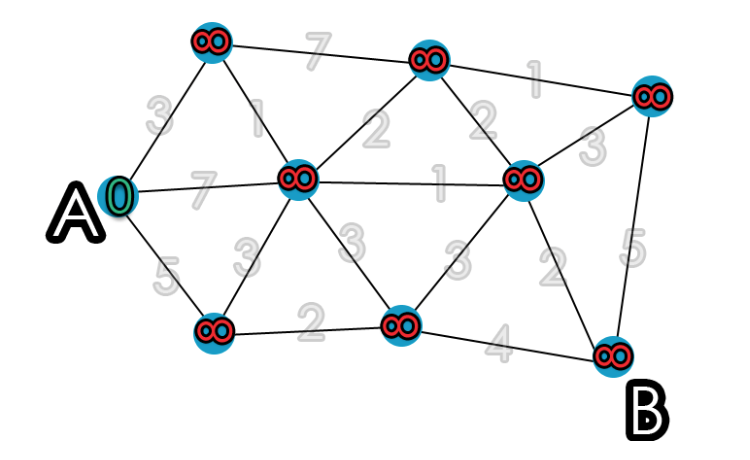
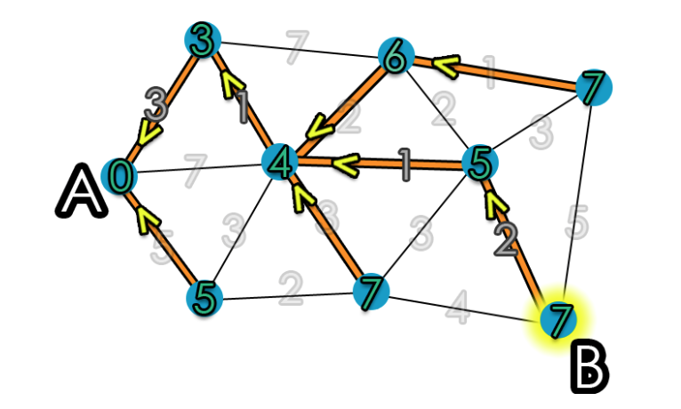
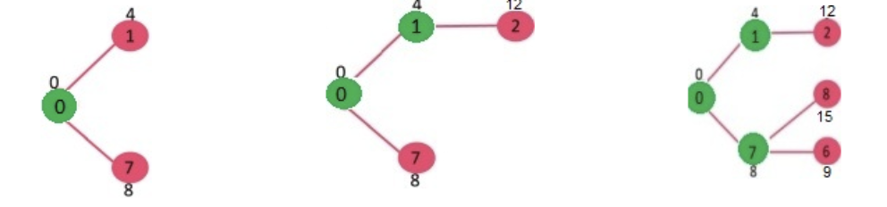

Dijkstra's Algorithm
===

<!-- page_number: true -->
<!-- footer: Team Name -->


##### A Deep Dive and Implementation 

###### Created by Surya Dantuluri, William Lee, Allen Liang, Tony Lin, and Harris Shepard

---

# Introduction

- **"Simplicity is a prerequisite for reliability" - Edsger Dijkstra**
- 
- A search algorithm and graph data structure designed to find the shortest path between two nodes in a connected graph.
- Designed by Edsgar Dijkstra in 1956

---

# Explanation


- There are nodes (or vertices)
- Weigted edges connect nodes

---
# Explanation Continued
- ```dist``` initialized, an array to store distances from source node
  - ```dist(s) = 0``` since the distance from source node should be 0
  - ```dist(v) = infinity``` since distances to all other nodes are unknown
  - $Q$, a queue is used to store all nodes in the graph, $Q$ will be empty by the time the algorithm is done
  - $S$ represents the set of nodes the algorithm visited

---
# Psuedo-explanation
Suppose you have this connected graph:


---

Calculate distances to adjacent nodes


---

Pick node closest to source node


---

Finally we get


---
# Psuedocode

```
dist[s] = 0
for all other distances:
	dist[v] = infinity
   
S					#initialize
Q = V					#initialize V
	
while Q not null:		#initalize Q is not null
	do u = minDistance(Q) #select element u w/ min dis
    	S = S union {u} # add u to list of visited vert.
        for all v in neighbors of {u}
        	do if dist[v]>dist[u] + w(u,v)
            		# if new shortest path found
            		then d[v] = d[u]+w(u,v)
                    #set value of shortest path


```

---
# Another Implementation
- Given a graph with weighted edges, construct a shortest-path “tree.”
- Create a min heap and put in all the vertices.
  - Ordered by distance from source.
- Any node added into the SPT will be removed from this heap.


---
# Another Implementation Continued 
- Start by adding the source node into the SPT.
- Retrieve the top of the heap (a.k.a. the node closest to the source) and add it to the SPT.
- Update distances of nodes adjacent to the picked node.
- Repeat above two steps until every node is in the SPT/nothing left in the heap.



---

# Another Implementation Extended 
- Completed SPT:


---

# Data Structures Used
- Adjacency Matrix
  - Used to store the graph.
- Arrays
  - Min heap and adjacency matrix implementation uses this.
  - ArrayLists/Vectors could have been used, but that would be excessively complicated.
- Heaps
  - Used to determine the node closest to the source to add to the SPT.
- Linked Lists
  - Used as adjacency lists for each vertex.


---
# Big O Analysis
- Our implementation: O(n^2)
- Can be improved by simply storing the edges instead of the entire graph to O(ELogV)
  - E - Number of edges.
  - V - Number of vertices.


---
# Implementation

---

## Have a nice day!
